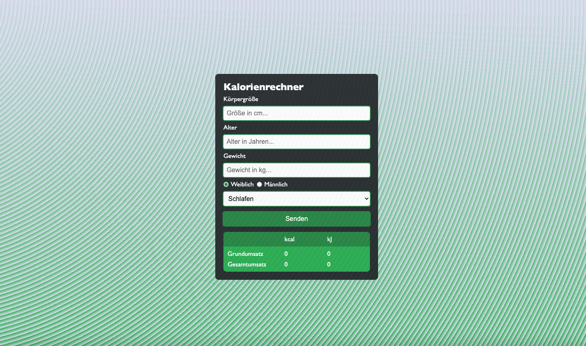

# Value Added Tax Calculator

This application serves as a calorie calculator that accurately computes the Basal Metabolic Rate (BMR) and Total Daily Energy Expenditure (TDEE) in both kcal and kJ for both men and women. It takes into account the Physical Activity Level (PAL) factor, which varies based on an individual's daily physical exertion.

## Table of contents

- [Overview](#overview)
  - [Screenshot](#screenshot)
  - [Links](#links)
- [My process](#my-process)
  - [Built with](#built-with)
  - [What I learned](#what-i-learned)
  - [Continued development](#continued-development)
  - [Useful resources](#useful-resources)
- [Author](#author)

## Overview

### Screenshot

#### Desktop:

### Links

- Solution URL: [index.html](https://github.com/wilhelm-lenz/calorie-calculator/blob/main/index.html)
- Solution URL: [style.css](https://github.com/wilhelm-lenz/calorie-calculator/blob/main/assets/css/style.css)
- Solution URL: [main.js](https://github.com/wilhelm-lenz/calorie-calculator/blob/main/assets/js/main.js)
- Live Site URL: [calorie-calculator](https://wilhelm-lenz.github.io/calorie-calculator/)

## My process

### Built with

- Semantic HTML5 markup
- SCSS custom properties
- JavaScript

### What I learned

I learned how to approach a project like this, how to plan it, and what challenges the HTML structure can present. It's crucial to proceed in a structured manner and not to use too many wrapping elements. However, these elements sometimes make later design work easier. Also in this project (as in the value-added-tax-calculator project) I wrote javascript code directly after the html, before beginning the design. In future projects, I will make sure to create at least a basic design to have a better overview of the data output via JavaScript. I found this approach personally more manageable.

### Continued development

In the subsequent phase of this project, my primary focus will be on code refactoring to enhance its modularity. I am committed to adhering to best practices to streamline the codebase. Furthermore, I intend to revise the existing HTML structure to ensure greater semantic coherence. As part of the development roadmap, the application will be deployed as a standalone app via Netlify, which necessitates a design where the calculator occupies the entire viewport.

### Useful resources

- Netlify - [@app.netlify](https://app.netlify.com/drop/) [@netlify](https://netlify.com): Netlify is a development platform that allows you to scale a web application. For instance, a programmed web application can easily be turned into a mobile web app.

## Author

- Wilhelm Lenz - [@wilhelm-lenz](https://github.com/wilhelm-lenz)
